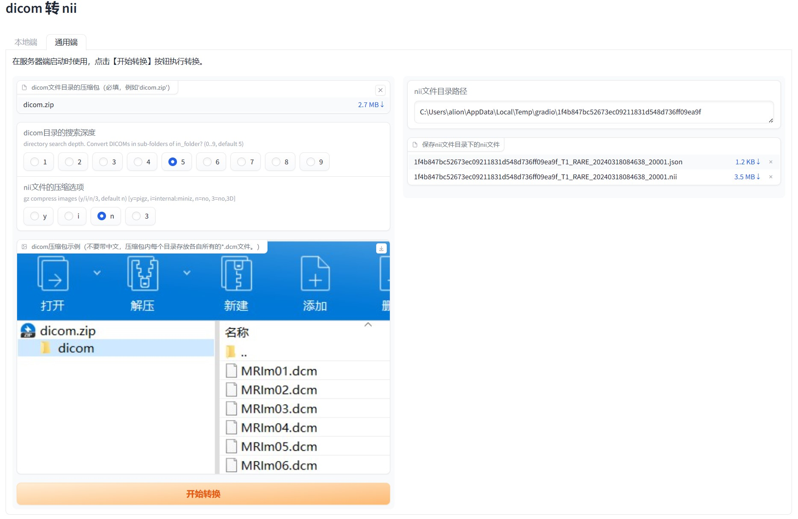

# dicom2nii-webui

The web UI for dcm2nii (DICOM to NIfTI converter)

## 描述

- 功能：利用 [dcm2niix](https://github.com/rordenlab/dcm2niix) 将 **dicom** 文件转为 **nii** 文件
- 可视化：使用 [Gradio](https://github.com/gradio-app/gradio) 将该功能可视化，分为本地电脑使用和服务端使用方式

## 本地端
- 在本地电脑端启动时使用
- 说明：填入dicom文件目录路径、nii文件保存路径，点击【开始转换】即可

## 通用端
- 在本地电脑端、服务器端启动时皆可使用。在服务端部署后，可供多人在线使用。
- 说明：上传dicom文件目录的压缩包（必填，例如'dicom.zip'），点击【开始转换】即可

## 安装
- 新建一个虚拟环境 Python 3.9.16
- 依赖
  - `$ pip install gradio==4.29 -i "https://pypi.doubanio.com/simple/"`
  - `$ pip install dcm2niix -i "https://pypi.doubanio.com/simple/"` 
    - dcm2niix 当前版本为 1.0.20220715

## 启动
- 直接执行 `$ python main.py`