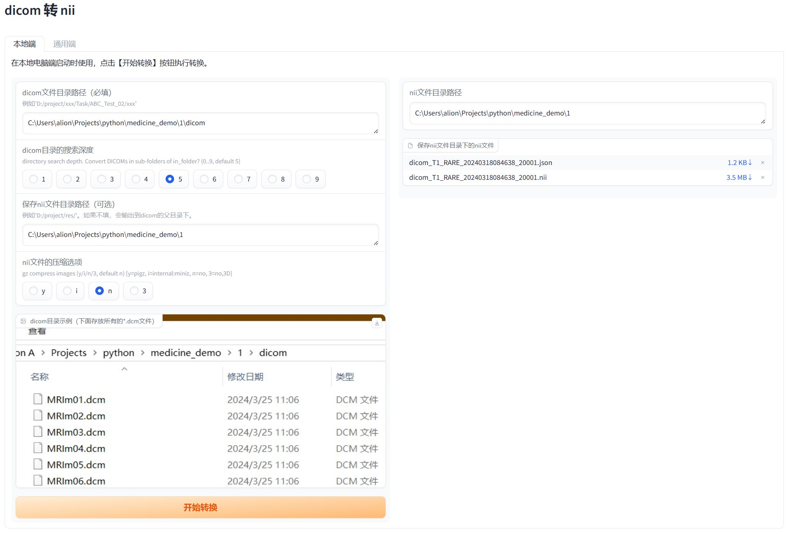

# dicom2niix-webui

The web UI for dcm2niix (DICOM to NIfTI converter)

## 描述(Description)

- 功能：利用 [dcm2niix](https://github.com/rordenlab/dcm2niix) 将 **dicom** 文件转为 **nii** 文件
- 可视化：使用 [Gradio](https://github.com/gradio-app/gradio) 将该功能可视化，分为本地电脑使用和服务端使用方式

## 安装(Install)
- 新建一个虚拟环境(Python 3.9.16)，或使用已有的Python环境
  - 例如 `$ conda create -n env_name python=3.9` 
- 安装依赖
  - `$ pip install gradio==4.29 -i "https://pypi.doubanio.com/simple/"`
  - `$ pip install dcm2niix -i "https://pypi.doubanio.com/simple/"` 
    - dcm2niix 当前版本为 1.0.20220715
- 下载本项目代码
  - 点击[本项目GitHub页面](https://github.com/AlionSSS/dcm2niix-webui)右上角的绿色的按钮`Code`，再点击`Download ZIP`

## 启动服务(Start Service)
- 进入到本项目的目录下
- 二选一
  - 在本地电脑端启动，直接执行 `$ python main.py`
  - 在服务器端启动，执行 `$ nohup python main.py 1>server_run.log 2>&1 &`

## 操作说明(Operating Instructions)
### 本地端(For Local)
- 在本地电脑端启动时使用（打开浏览器，访问 http://localhost:7860）
- 说明：填入dicom文件目录路径、nii文件保存路径，点击【开始转换】即可

### 通用端(For Universal)
- 在本地电脑端、服务器端启动时皆可使用。
- 在服务端部署后，可供多人在线使用。（打开浏览器，访问 http://服务器IP:7860）
- 说明：上传dicom文件目录的压缩包（必填，例如'dicom.zip'），点击【开始转换】即可

